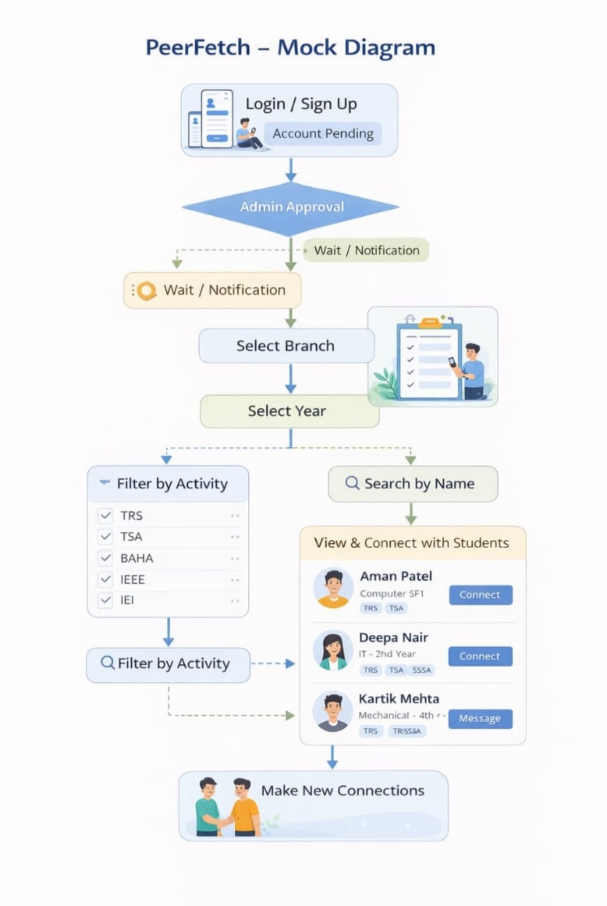
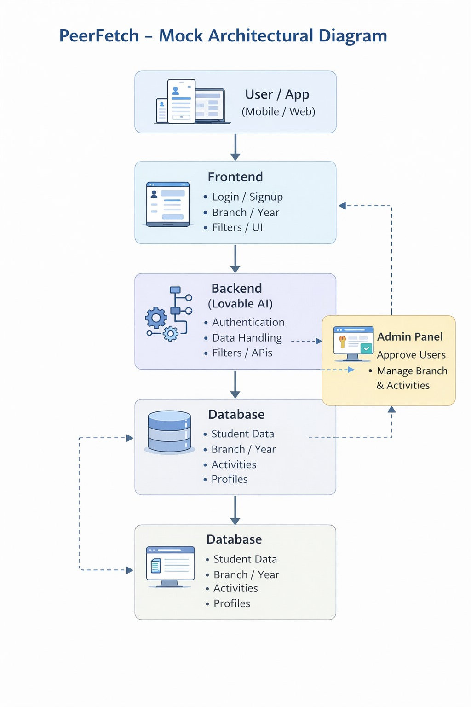
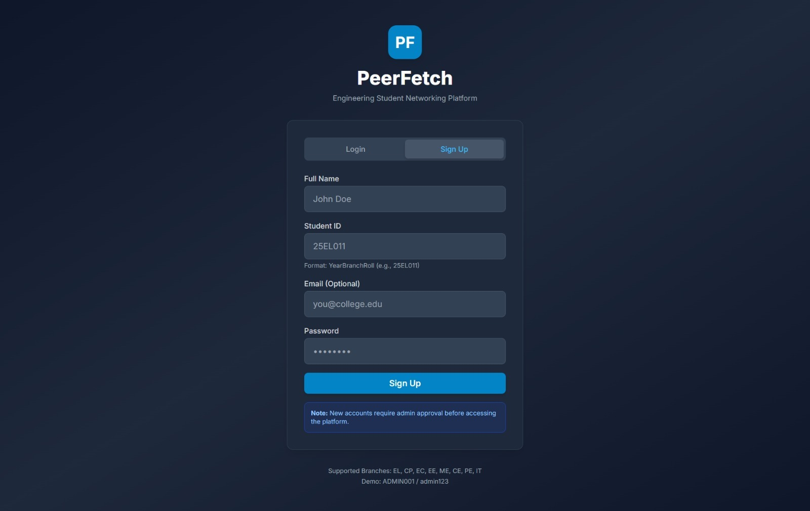
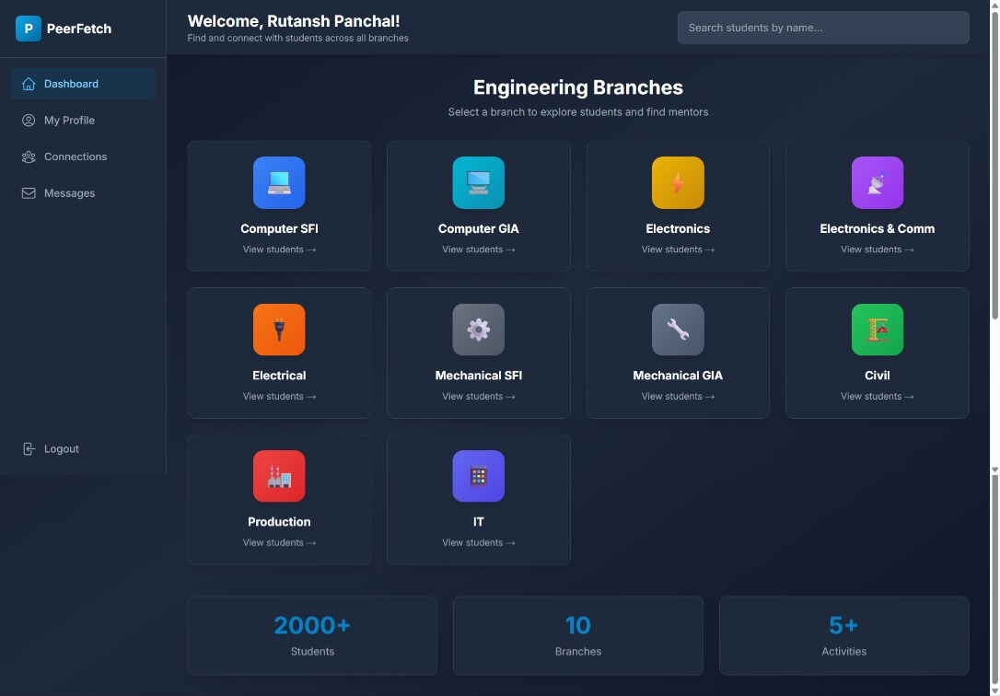
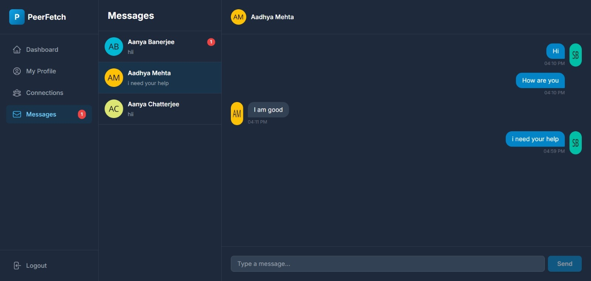

# 🚀 PeerFetch
### Engineering Student Networking & Mentorship Platform

PeerFetch is a full-stack web application designed to help junior engineering students connect with seniors for academic guidance, project collaboration, career advice, and mentorship.

The platform was developed during a hackathon with the goal of creating a centralized student networking ecosystem inside a college campus.

---

# 📌 Problem Statement

In engineering colleges, juniors often struggle to find seniors who can help them with:

- Academic guidance
- Subject preparation
- Internship advice
- Hackathon teams
- Technical mentorship
- Career roadmaps

PeerFetch solves this problem by creating a LinkedIn-like platform exclusively for students within a campus.

---

# ✨ Key Features

## 🔐 Authentication System

- Student Login & Signup
- Unique Student ID validation
- Password protected accounts
- Session-based authentication

---

## 👨‍💼 Admin Approval Panel

- Dedicated Admin Dashboard
- New registrations remain pending
- Admin verifies and approves accounts
- Only approved students can access the platform

---

## 🎓 Branch-wise Student Directory

Supports multiple engineering branches:

- Electronics Engineering
- Electronics & Communication
- Computer Engineering
- Information Technology
- Electrical Engineering
- Mechanical Engineering
- Civil Engineering
- Production Engineering

Each branch is further divided into:

- 1st Year
- 2nd Year
- 3rd Year
- 4th Year

---

## 🔍 Smart Search & Filtering

- Search students by name
- Filter by branch
- Filter by academic year
- Filter by activities and technical clubs

Examples:

- IEEE
- IEI
- TRS
- TSA
- BAHA

---

## 👤 Student Profiles

Each profile contains:

- Profile Picture
- Bio
- Technical Skills
- Branch
- Academic Year
- Club Activities
- Extra-Curricular Information

Students can also send mentorship requests to seniors.

---

## 🤝 Mentorship System

The platform enables juniors to:

- Discover seniors
- View technical expertise
- Connect for mentorship
- Build academic relationships

---

## 🌙 Modern User Interface

- Responsive Layout
- Dark Theme Support
- Tailwind CSS Design
- Smooth Animations
- Professional Dashboard Experience

---

# 🛠️ Technology Stack

| Category | Technology |
|----------|------------|
| Frontend | Next.js 14 |
| Language | TypeScript |
| Styling | Tailwind CSS |
| Backend | Node.js |
| Database | SQLite |
| ORM | Prisma |
| Authentication | Custom Session Authentication |

---

# 🏗️ System Architecture



---

# 🔄 Project Workflow



---

# 📸 Project Screenshots

## Dashboard Home



---

## Student Directory



---

## Mentorship Platform



---

# 📂 Project Structure

```
peerfetch/
│
├── app/
├── lib/
├── prisma/
├── public/
├── components/
├── package.json
└── README.md
```

---

# 🧠 Student ID Format

```
YYBBBRRR
```

Where:

- YY → Admission Year
- BBB → Branch Code
- RRR → Roll Number

Example:

```
25EL011
```

Means:

- Batch : 2025
- Branch : Electronics
- Roll Number : 011

---

# ⚙️ Installation

## Clone Repository

```bash
git clone https://github.com/rutanshpanchal/Peerfetch-campus-guidance-platform.git
```

## Install Dependencies

```bash
npm install
```

## Generate Prisma Client

```bash
npx prisma generate
```

## Push Database Schema

```bash
npx prisma db push
```

## Seed Database

```bash
npm run db:seed
```

## Run Development Server

```bash
npm run dev
```

Open:

```
http://localhost:3000
```

---

# 🔑 Demo Credentials

### Admin

```
ID: ADMIN001
Password: admin123
```

### Student

Example:

```
ID: 25EL001
Password: password123
```

---

# 🚀 Future Improvements

- Real-time Chat System
- Direct Messaging
- Video Calling
- AI-based Senior Recommendation
- Internship & Job Board
- Project Collaboration Module
- Notification System

---

# 👨‍💻 My Contribution

As a team member, I contributed to the design and development of the PeerFetch platform, including frontend implementation, UI design, feature integration, and project deployment during the hackathon.

---

# 🎯 Project Objective

The goal of PeerFetch is to bridge the communication gap between junior and senior engineering students by creating a digital mentorship ecosystem that promotes learning, collaboration, and technical growth.

---

## ⭐ If you like this project, consider giving it a star!
